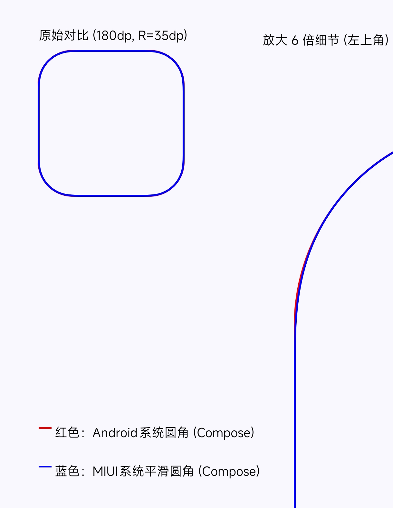

# MIUI 平滑圆角算法

**一个专为 Compose 设计的 MIUI 风格平滑圆角算法，让圆角边缘更自然、更舒适**
-----------------------------------------------------------------------------------

## ✨ 项目简介
本项目通过反编译 **MIUI 系统应用** 的平滑圆角处理算法，实现**视觉上极致顺滑**的圆角效果。

**📸 效果对比**：

- 蓝色为MIUI平滑圆角
- 红色为Android系统默认实现的圆角

---

## 🎯 核心特性

- ✅ **极致平滑**：消除传统圆角的“硬边”视觉突兀感- ✅ **MIUI 原生还原度**：视觉效果与小米系统应用圆角一致
- ✅ **目前仅支持ViewSystem**
- ✅ **若您需要ViewSystem版本可在另外一个仓库查看**

---